# BERT 10 Fold Cross Validation
## Results

10_fold

10_fold_hannah

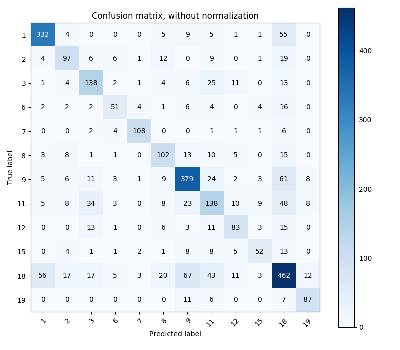
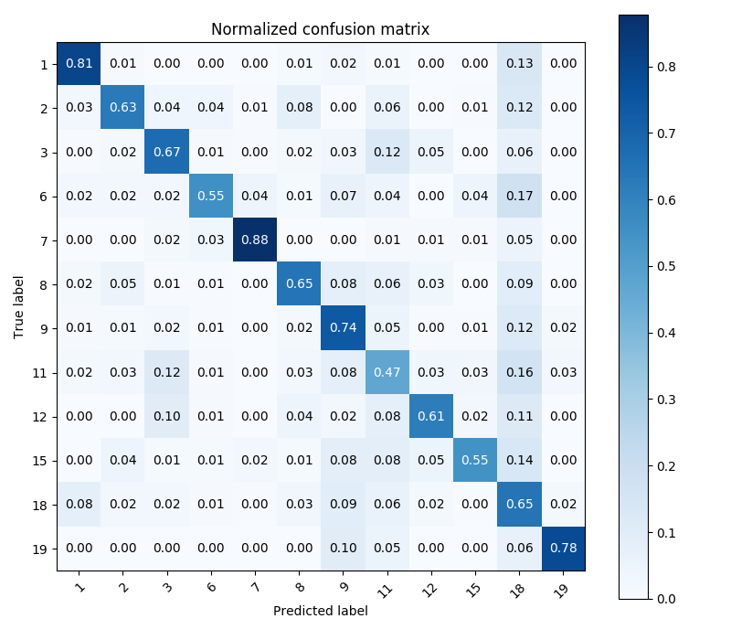

10_fold_nick

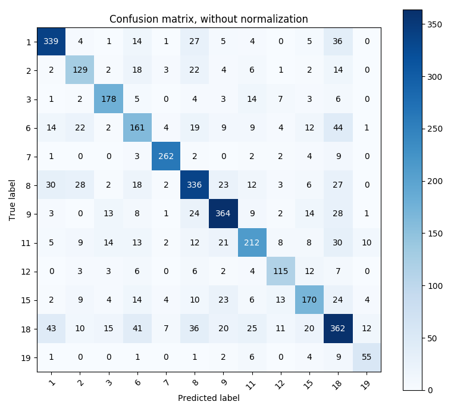
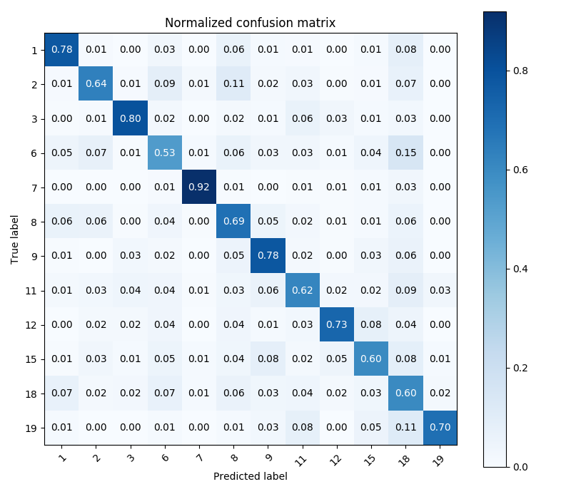

10_fold_time

10_fold_time_period

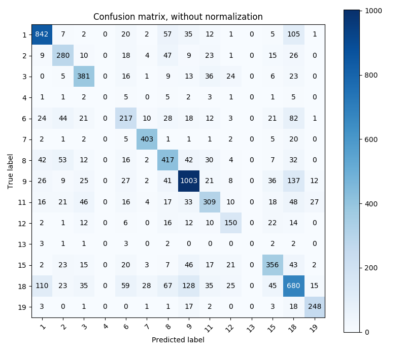
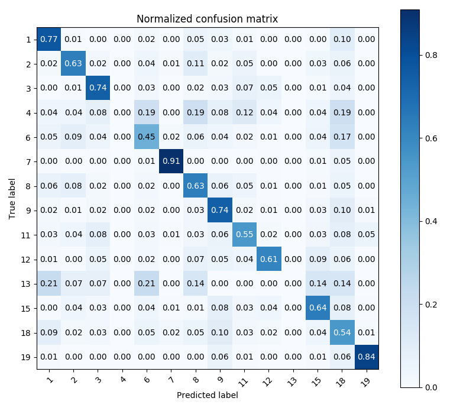

10_fold_time_periodV2

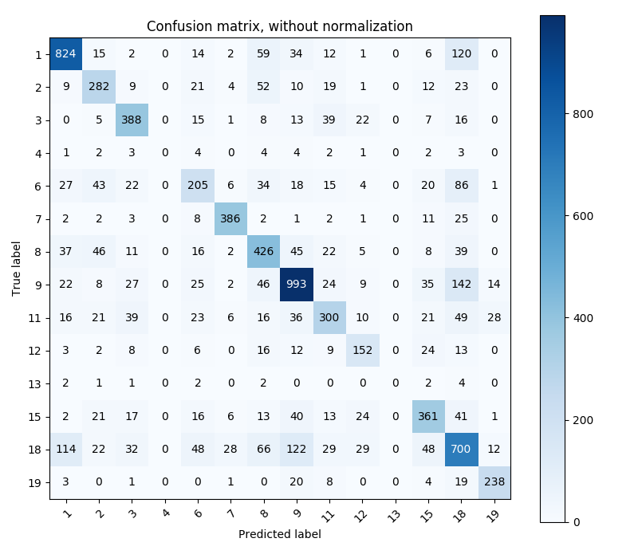
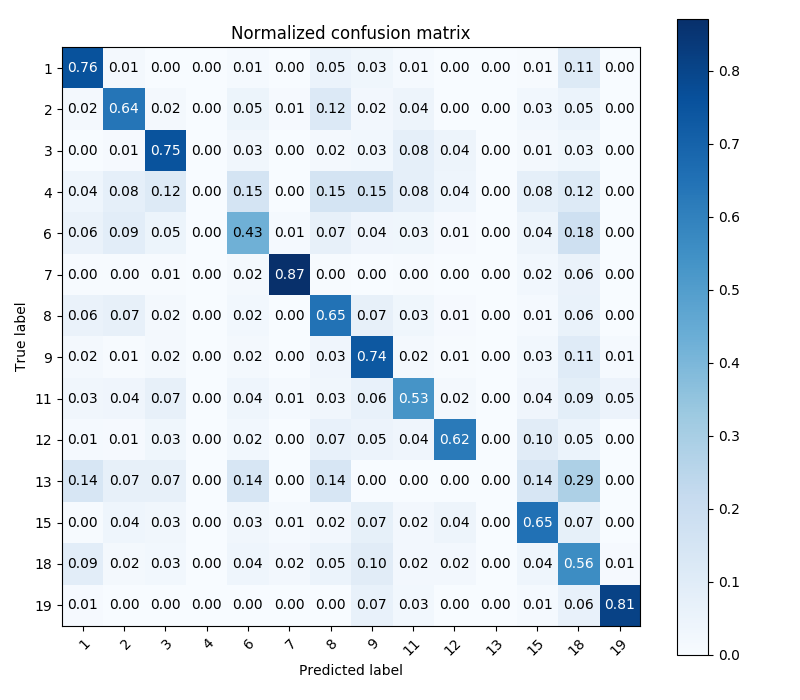

10_fold_time_periodV3

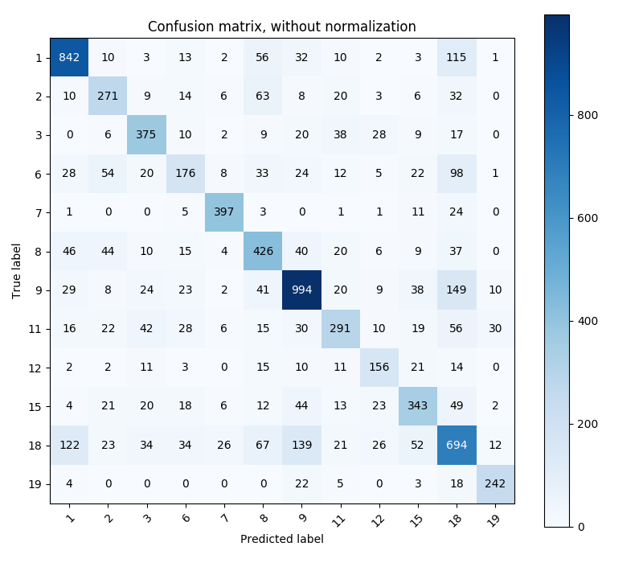
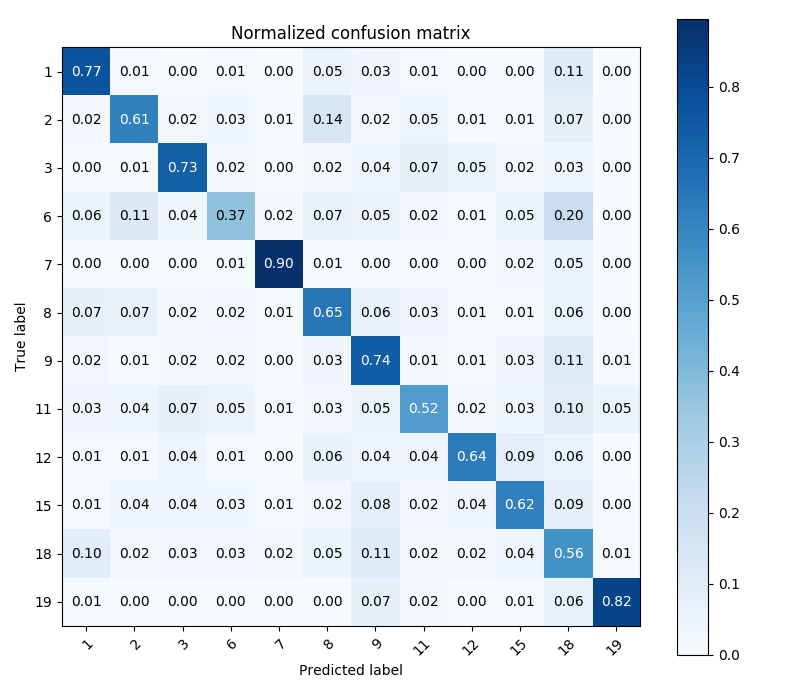

10_fold_C2_time_periodV3

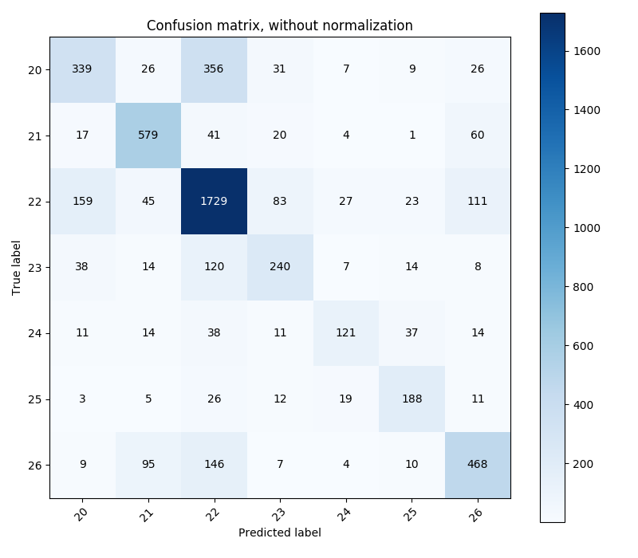
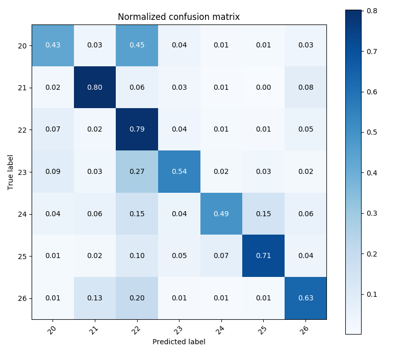

